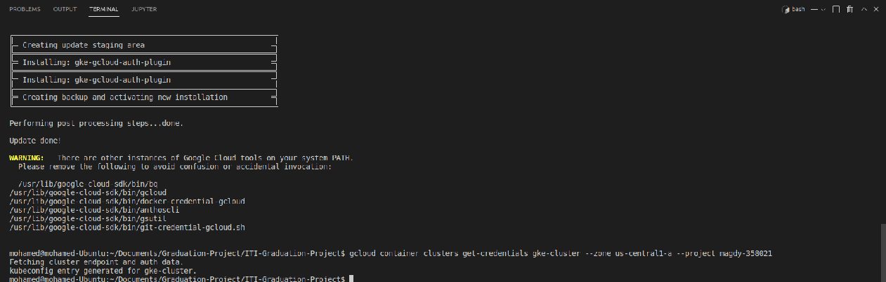
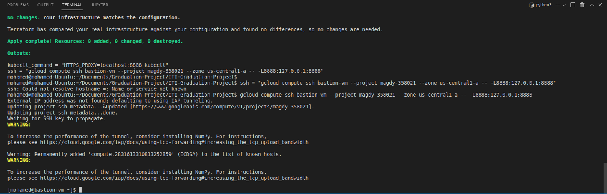

# ITI Graduation Project

# Deploy backend application on kubernetes cluster using CI/CD jenkins pipeline using the following steps and high-level:
1. Implement secure Kubernetes cluster
2. Deploy and configure Jenkins on Kubernetes.
3. Deploy backend application on Kubernetes using Jenkins pipeline.


# GCP Infrastructure Resources
1. Create a network module
2. Create a Kuberenetes Cluster 
3. Create VM to access Kuberenetes Cluster and act as jenkins slave


# Commands to provision the infrastructure on GCP
```bash
# initialize terraform
terraform init

# check using plan
terraform plan --var-file infrastructure.tfvars

# applying the plan 
terraform apply --var-file infrastructure.tfvars

```

# Deploying on Kubernetes cluster
1. Create deployment and service for jenkins in jenkins-namespace
2. Create deployment and service for application in application namespace

# Screenshots:
# figure 1

# figure 2
